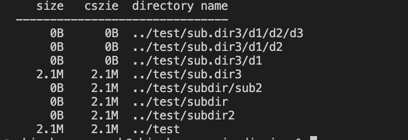

# dirsize
command line utility wiritten in golang that calcutes the size of the directory.

## Build
```
env GOOS=darwin GOARCH=amd64 go build -o <ouput directory>
```

Note: This executable was buit on the following architecture

- GOHOSTARCH=arm64
- GOHOSTOS=darwin

## Usage
```
 Name:
 dirsize - calculates the directory size and prints it
    
 Usage:
 dirsize [Options] <dirirectory list>
    
 Options:
--human      Prints size in human-readable format
--recursive  Prints size of subdirectories recursively
--help       Help command

eg: dirsize --human --recursive dir1 dir2

Output: 
size  cszie  directory name
-------------------------------

size           - the size of the file
cszie          - cummulative size 
directory name - the name of the directory
```

## Output


## Test
To test the code, run the test cases inside the tests folder. 

```
cd test
go test -v
```

## Author Details:
Shivakumar Suresh <br>
Syracuse University